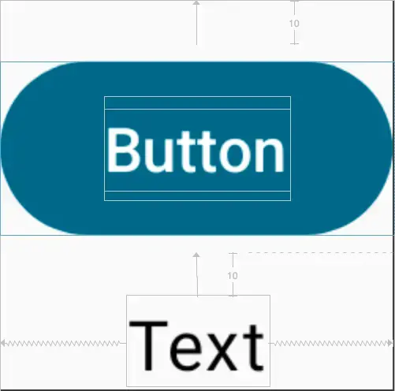
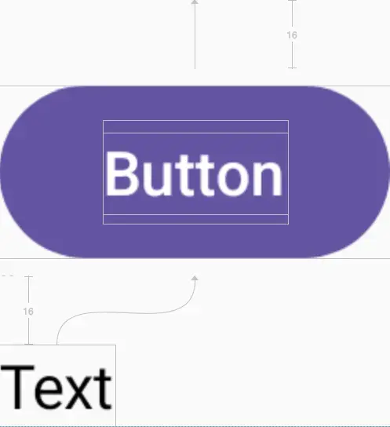
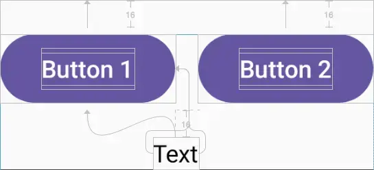
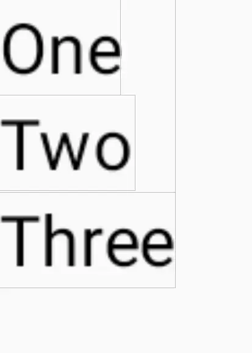
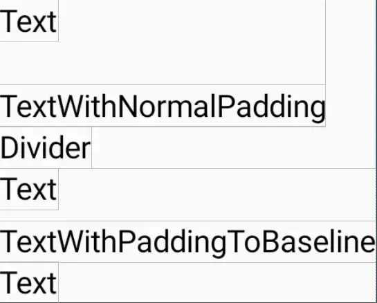

# Constraint Layout

Using Constraint Layout and built-in Layout composable to measure and render
custom layout and define relationship between composable.

## Dependency

```gradle
implementation("androidx.constraintlayout:constraintlayout-compose:1.0.1")
```

## Index

| No | Layout                                                          |
| -- | :-------------------------------------------------------------- |
| 1  | [Basic constraint layout](#basic-constraint-layout)             |
| 2  | [Decoupled constraint layout](#decoupled-constraint-layout)     |
| 3  | [Large constraint layout](#large-constraint-layout)             |
| 4  | [Linked constraint layout](#linked-constraint-layout)           |
| 5  | [Intrinsic size](#intrinsic-size)                               |
| 6  | [Measured layout](#measured-layout)                             |
| 7  | [Text with padding to baseline](#text-with-padding-to-baseline) |

# Basic Constraint Layout

```kt
ConstraintLayout {
    val (button, text) = createRefs()
    Button(onClick = {}, modifier = Modifier.constrainAs(ref = button) {
        top.linkTo(anchor = parent.top, margin = 10.dp)
    }) { Text(text = "Button") }
    Text(text = "Text", modifier = Modifier.constrainAs(ref = text) {
        top.linkTo(anchor = button.bottom, margin = 10.dp)
        start.linkTo(anchor = parent.start)
        end.linkTo(anchor = parent.end)
    })
}
```



# Decoupled Constraint Layout

```kt
BoxWithConstraints {
    val constraints = if (maxWidth < maxHeight) {
        decoupledConstraints(margin = 16.dp) // Portrait constraints
    } else {
        decoupledConstraints(margin = 32.dp) // Landscape constraints
    }
    ConstraintLayout(constraints) {
        Button({}, Modifier.layoutId("button")) { Text("Button") }
        Text("Text", Modifier.layoutId("text"))
    }
}

fun decoupledConstraints(margin: Dp): ConstraintSet = ConstraintSet {
    val button = createRefFor("button")
    val text = createRefFor("text")
    constrain(button) { top.linkTo(parent.top, margin = margin) }
    constrain(text) { top.linkTo(button.bottom, margin) }
}
```



# Large Constraint Layout

```kt
ConstraintLayout {
    val text = createRef()
    val guideline = createGuidelineFromStart(fraction = 0.5f)
    Text(
        "This is a very very very very very very very long text",
        Modifier.constrainAs(text) {
            linkTo(start = guideline, end = parent.end)
            width = Dimension.preferredWrapContent
        }
    )
}
```


# Linked Constraint Layout

```kt
ConstraintLayout {
    val (button1, button2, text) = createRefs()
    Button({}, Modifier.constrainAs(button1) {
        top.linkTo(parent.top, margin = 16.dp)
    }) { Text("Button 1") }
    Text("Text", Modifier.constrainAs(text) {
        top.linkTo(button1.bottom, margin = 16.dp)
        centerAround(button1.end)
    })
    val barrier = createEndBarrier(button1, text)
    Button({}, Modifier.constrainAs(button2) {
        top.linkTo(parent.top, margin = 16.dp)
        start.linkTo(barrier)
    }) { Text("Button 2") }
}
```



# Intrinsic Size

```kt
Row(Modifier.height(IntrinsicSize.Min)) {
    Text(
        text = "Hello",
        modifier = Modifier
            .weight(1f)
            .padding(start = 4.dp)
            .wrapContentWidth(align = Alignment.Start)
    )
    Divider(
        Modifier
            .fillMaxHeight()
            .width(width = 1.dp),
        color = Color.Black
    )
    Text(
        text = "World",
        modifier = Modifier
            .weight(weight = 1f)
            .padding(end = 4.dp)
            .wrapContentWidth(align = Alignment.End),
    )
}
```


# Measured Layout

```kt
Layout({
    Text("One")
    Text("Two")
    Text("Three")
}, Modifier.wrapContentHeight()) { measurables, constraints ->
    val placeables = measurables.map { it.measure(constraints) }
    var yPosition = 0
    layout(constraints.maxWidth, constraints.maxHeight) {
        placeables.forEach {
            it.placeRelative(0, yPosition)
            yPosition += it.height
        }
    }
}
```



# Text with Padding to Baseline

```kt
Column {
    Column {
        Text("Text")
        Text("TextWithNormalPadding", Modifier.padding(top = 20.dp))
    }
    Text(text = "Divider")
    Column {
        Text("Text")
        Text("TextWithPaddingToBaseline", Modifier.firstBaselineToTop(20.dp))
        Text("Text")
    }
}

fun Modifier.firstBaselineToTop(firstBaselineToTop: Dp) = this.then(
    layout { measurable, constraints ->
        val placeable = measurable.measure(constraints)
        // Check the composable has a first baseline
        check(placeable[FirstBaseline] != AlignmentLine.Unspecified)
        val firstBaseline = placeable[FirstBaseline]
        // Height of the composable with padding - first baseline
        val placeableY = firstBaselineToTop.roundToPx() - firstBaseline
        val height = placeable.height + placeableY
        layout(placeable.width, height) {
            // Where the composable gets placed
            placeable.placeRelative(0, placeableY)
        }
    }
)
```


