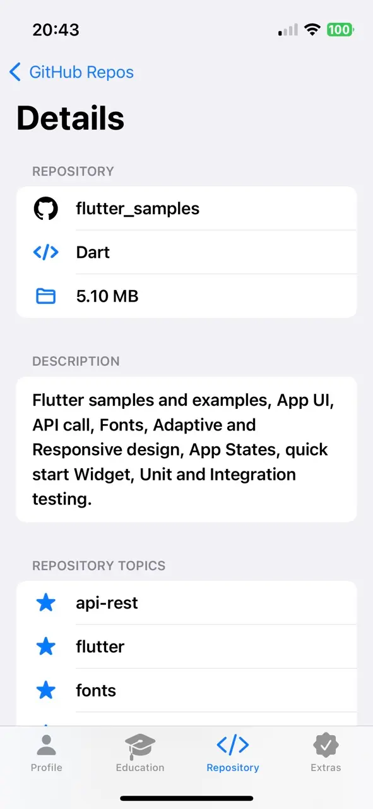

# Mitul Vaghamshi - Portfolio

Portfolio App in Android (Jetpack Compose) and iOS (SwiftUI) with Kotlin
Multiplatform Mobile (KMM).

Access (Flutter) Web Version @ https://mitulvaghamshi.github.io

## Preview (Android)

## Preview (iOS)

 
 
 
 
 
 
